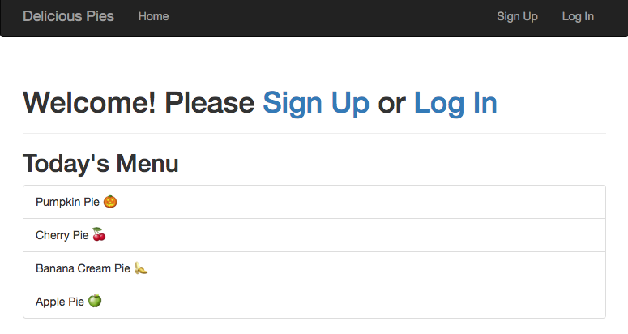

# Delicious Pies: A sample Flask app to practice analytics on




To build your own app, first clone this repo somewhere and cd into it.
```
git clone https://github.com/timabe/pies
cd pies
```

Next you'll create a python virtual environment and install the requirements
```
pip install virtualenv
virtualenv venv
source venv/bin/activate
pip install -r requirements.txt
```

## Testing and Running Locally
First create the local database and add the Pies menu

```
python manage.py shell
>>> db.create_all()
>>> Pies.add_menu()
>>> quit()
```

Now you can run and play around with the functionality. Just run `python manage.py runserver` and navigate to [http://127.0.0.1:5000/](http://127.0.0.1:5000/) or [localhost:5000](localhost:5000) in a browser.

## Deploying with Heroku
Sign up for a free [Heroku](https://signup.heroku.com) account if you don't have one. Once you've done that, download their [command line tools](https://devcenter.heroku.com/articles/heroku-cli).

Log into your account in a terminal window.
```
# log in and enter credentials
heroku login
# create an app. This creates the URL and a git repo
heroku create <optional-name>
# add your db
heroku addons:add heroku-postgresql:hobby-dev
# set up some heroku environment vars
heroku config:set FLASK_CONFIG=heroku
heroku config:set SECRET_KEY=<your secret key>
# push your code to the remote heroku git repo
git push heroku master
# now you can deploy the app!
heroku run python manage.py deploy --make_menu --seed
```
Once you've run that, you should be able to visit the url they gave you, which should look something like this `https://<app_name>.herokuapp.com` and open up the application.

### Cleaning up
If you want to delete the app just run `heroku apps:destroy <YOUR APP NAME>`

## Thanks and Credit
I would not have been able to create this app without relying heavily on the Flask tutorials and books written by [Miguel Grinberg](https://blog.miguelgrinberg.com/). Most of the code in this app is forked from his wonderful tutorial on building a microblogging service. For a great, comprehensive guide on building apps with the Flask framework, check out his [tutorial](https://blog.miguelgrinberg.com/post/the-flask-mega-tutorial-part-i-hello-world) and buy his [O'Reily book](http://shop.oreilly.com/product/0636920031116.do), they are both great.

